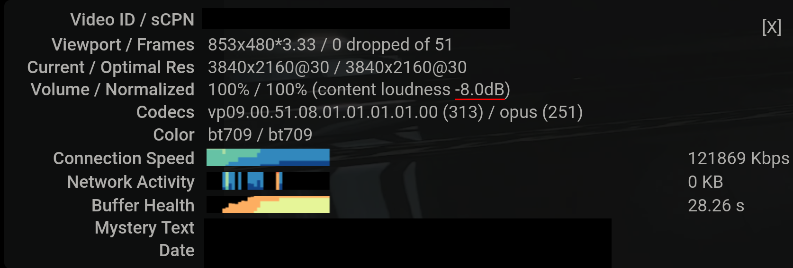
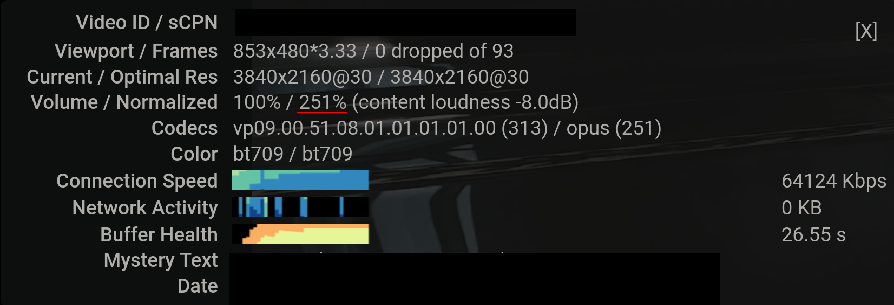

# YouTube Volume Normalizer

This extension normalizes YouTube volume by increasing the volume if it is too soft. YouTube by default will only lower the volume if it is too loud.

This extension simulates mouse clicks to obtain the statistics of the video, which shows the content loudness relative to the YouTube preferred level. For example, the below screenshot shows a video with content loudness of -8.0dB before applying this extension (as highlighted):

With this extension, if the content loudness is below 0 dB, either the audio will be amplified, or the system volume will be increased (can be selected, see below). For example, if it is -8.0 dB, a gain of 8.0 dB will be applied, and the loundness will become $10^\frac{8}{20} \times 100\\% = 251\\%$ of the original volume. See the below screenshot:

# Modes: Amplification or System Volume

By default, amplification is used, but system volume is strongly recommended unless you often play different audio concurrently.

## Amplification

Under this mode, the audio will be amplified to the YouTube preferred level.

However, this can cause clipping because the volume after amplification may go beyond the maximum volume. To handle that, a dynamic compressor is used as a limiter to avoid clipping.

### Pros:

This mode will not affect concurrent playback (e.g., if you play YouTube video when you are in a video conference).

### Cons:

Amplification can hurt audio quality in two ways:

1. The dynamic compressor may slightly change the sound.

2. If the system volume is below 100%, the volume is first increased and then reduced. This can cause a lost in accuracy due to numerical error. In contrast, simply tune up the system volume when the audio is too soft will not suffer from this problem.

The above problems are not audible to my ears, but they may be audible to audiophiles.

## System Volume

This mode currently only works under Linux with PulseAudio.

Under this mode, the system volume will be increased accordingly so that the audio volume sounds the same as the YouTube preferred level.

### Installation

Run `./install.sh` and input the browser you use.

### Pros:

This will not create artifacts like amplification.

### Cons:

Be careful if you tend to play different audio *concurrently*.

If the concurrent audio is also from YouTube, this extension will choose the lowest gain to protect your ears (e.g., if one video needs 2dB of gain, while the other needs 1dB, only 1dB will be applied).

If the concurrent audio is not from YouTube, the extension will not know about it. So, **if you play a very loud audio outside of YouTube concurrently with a very quiet YouTube video, the final volume will be *very* loud.**

